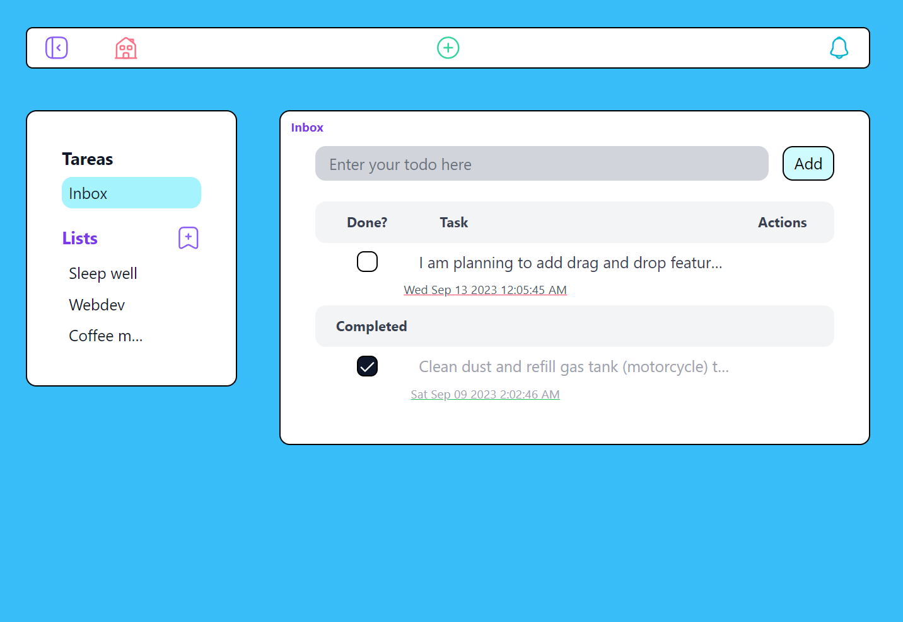

# JoyFlow
A task manager app, with statistics and a pomodoro timer (pending feature)

The main purpose of this app is to help you organize and manage your personal projects in list, tasks and define how you are going to manage your time during the day.

## Update roadmap

My goal right now is to update every dependency to 2024, improve the code and add some core features that will make the application more useful. Here are the main topics to explore in order:
- [x]] Update to last React version, 19, including the optimizations provided by the React compiler and using other tools to check suboptimal configuration in the app.
- [ ] Update tailwindcss to 4.0 - in progress
- Check other dependencies.
- Avoid unnecessary rendering, and familiarize with the code again (heavy development of the app was done a couple of years ago)
- Add new features: better description box (as a kind of note), add filters to sort the tasks by certain parameters and add the option to use drag and drop to set a customized order.

## Stack

- React
- Typescript
- TailwindCSS
- Django
- SQL

## Features

- Create tasks. The concept of task/todo is used to represent something that you will do eventually which has at least a definition, purpose or topic (title). Tasks have the following properties:
  - Title
  - Description
    - An optional description of the task
  - Completed
    - Represents whether the task has been completed or not
  - Due date
    - A past/present/future date at which the task is suppose to be completed
  - Priority
    - Priorities give a definition of how important is the task being created. It has four option from least to most important: none, low, medium, high
  - List 
    - Tasks are associated to list. When no list is assigned it will be associated to the inbox list by default
- Create lists. Lists can represent a project, a list of tasks for the day or anything you want.Lists have the following properties:
  - Title
- Tasks created from the navigation bar can be associated to any current List. If no list is defined it will be associated to the default list for the current user(inbox)
- Tasks created from the task view only allow to define title and are associated to inbox by default
- Keyboard shortcuts
  - `s`: hide or show the sidebar
  - `q`: open the task creation modal from the navigation bar 
  - `h`: show the list defined as home list in the task view

## Development

Here are the instructions to run the application and start developing with hot reloading:

- Clone the repository in the location you choose. 
- Install a Python environment using `miniconda` or `uv`. If using `minicoda`, install `pip` with `conda install pip` and proceed to the python dependency installation with `pip install -r requirements.txt`
- Create `database` folder, add a previous existing database or create the database from scratch using `python manage.py migrate` on root folder. 
- Install `node`, the proceed to install every dependency by going to `jstoolchains` and running `npm install`
- [Create API](https://www.saaspegasus.com/guides/modern-javascript-for-django-developers/apis/) from specification in file `schema.yml`. 
  - Make sure you install the `openapi generator cli`: `npm install @openapitools/openapi-generator-cli`. This package will allow you to create the API via `schema.yml`, located at the root of the project. 
  - Once you have it installed, run: `npx @openapitools/openapi-generator-cli generate -i schema.yml -g typescript-fetch -o ../todo-api-client/`
- Bring `.env` file with custom credentials to use Gmail SMTP server
- Modify API call in the `jstoolchains` folder (go to `src\lib\api.ts`), make sure the call is to `127.0.0.1:8000`
- Run the python server using `127.0.0.1:8000` if using Linux. `0.0.0.0:8000` is required if making the call from `WSL2`.
- Run tailwind watch in a separate terminal by going to `jstoolchains` and running `npm run tailwind-watch`.
- Run webpack by opening a separate terminal, `cd jstoolchains` and running `npm run dev`
- Now go to the server address, you should be ready to start development!

### Running after setup
Once the initial setup is completed, generally you just need the following three commands (one per terminal session) to work on development mode:
- Run the python server from root with `python manage.py runserver 127.0.0.1:8000`. `0.0.0.0:8000` if using `WSL2`
- Run tailwind watch from `jstoolchains` folder with `npm run tailwind-watch`
- Run webpack from `jstoolchains` folder with `npm run dev` 

## Identity
The app name is JoyFlow. The goal is to create a system the user will enjoy using as  a companion while facing the challenges brought by the day. The user inferface is designed to be playful, clean and minimalistic. The flow part of the name is aspirational: the intention is for the system to help the user to induce and keep a state of flow while working on a project or mission.

### Base colors
The hue `600` as defined by the TailwindCSS system.

- Violet: `rgb(124,58,237)` (`violet-600`)
- Cyan:`rgb(2, 132,199)` (`cyan-600`)
- Fuchsia:`rgb(192,38,211)` (`fuchsia-600`)
- Red: `rgb(244,63,94)` (`rose-600`)
- Green:`rgb(5,150,105)` (`emerald-600`)
- Yellow:`rgb(217,119,6)` (`amber-600`)

The overal background of the app is `rbg(56,189,248)` (`sky-400`). The background of component is `white`. For input elements such TextArea, input or TextEditor the background is `rgb(17,24,39)` (`gray-900`).

# License

Pending...
