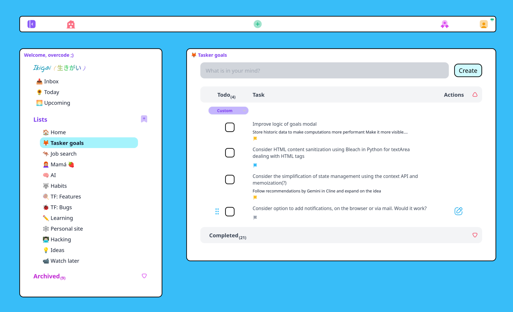

# Tasker with pomodoro timer (pending feature) and stats (pending feature)

Organize and manage your personal projects in list and tasks.

## Stack

- React
- Typescript
- TailwindCSS
- Django
- SQL

## Features

- Create tasks. The concept of task/todo is used to represent something that you will do eventually which has at least a definition (title). Tasks have the following properties:
  - Title
  - Description
    - An optional description of the task
  - Completed
    - Represents whether the task has been completed or not
  - Due date
    - A past/present/future date at which the task is suppose to be completed
  - Priority
    - Priorities give a definition of how important is the task being created. It has four option from least to most important: none, low, medium, high
  - List 
    - Tasks are associated to list. When no list is assigned it will be associated to the inbox list by default
- Create lists. Lists can represent a project, a list of tasks for the day or anything you want.Lists have the following properties:
  - Title
- Tasks created from the navigation bar can be associated to any current List. If no list is defined it will be associated to the default list for the current user(inbox)
- Tasks created from the task view only allow to define title and are associated to inbox by default
- Keyboard shortcuts
  - 's': hide or show the sidebar
  - 'q': open the task creation modal from the navigation bar 
  - 'h': show the list defined as home list in the task view

# License

Pending...
